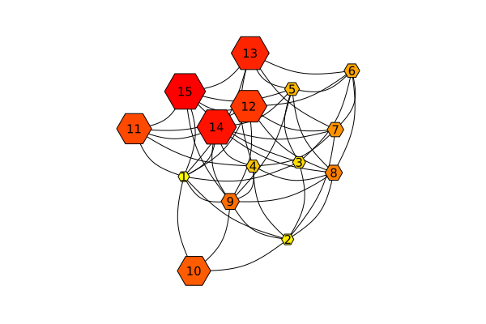

# Julia + Slidev

Presentation slides for Julia developers

---

# First Slide

This is a sample Julia script.  In it we can do the normal Julia things
like:

````julia
2 + 7
````

````
9
````

...and see the result.

We can add a comment with `---` in it to break the slide.

---

# Second Slide

See?  This content is now on a new slide?

---

# Third Slide

But, of course, things get more exciting when you add cool
multimedia Julia content, like plots:



---
src: ./deck2.md
---

---

*This page was generated using [Literate.jl](https://github.com/fredrikekre/Literate.jl).*

